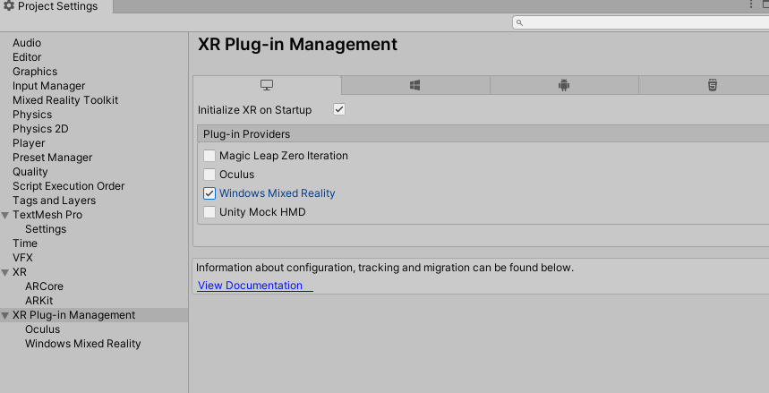

# Holographic Remoting

Holographic remoting streams holographic content from a PC to your Microsoft HoloLens in real-time, using a Wi-Fi or USB cable connection. This feature can significantly increase developer productivity when developing mixed reality applications.

XR SDK as mentioned below refers to Unity's [new XR pipeline in Unity 2019.3 and beyond](https://blogs.unity3d.com/2020/01/24/unity-xr-platform-updates/). See [here](../GettingStartedWithMRTKAndXRSDK.md) for more information on using XR SDK with MRTK. Legacy XR refers to the existing XR pipeline that is included in Unity 2018, deprecated in Unity 2019.3 and removed in Unity 2020.

## Initial setup

To enable remoting to a HoloLens, it is important to ensure that the project is using the latest remoting components.

1. Open **Window > Package Manager**
    - If using legacy XR: Verify that latest version of the **Windows Mixed Reality** package is installed.
    - If using XR SDK: Verify that latest version of the **Windows XR Plugin** package is installed.
1. Ensure the latest Holographic Remoting application is installed, on the HoloLens, via the Microsoft Store.

Please continue to [Legacy XR setup instructions](#legacy-xr-setup-instructions) or [XR SDK setup instructions](#xr-sdk-setup-instructions) depending on which pipeline is used in the project.

## Legacy XR setup instructions

The instructions below only apply to remoting with HoloLens 2. If you only perform remoting with HoloLens (1st Gen), skip to [Connecting to the HoloLens with Wi-Fi](#connecting-to-the-hololens-with-wi-fi).

When using a HoloLens 2, support for remoting articulated hand and eye tracking data has been added to MRTK. To enable these features, please follow the steps documented in [Import DotNetWinRT into the project](#import-dotnetwinrt-into-the-project).

Once imported, the next step is to select **Mixed Reality Toolkit** > **Utilities** > **Windows Mixed Reality** > **Check Configuration**. This step adds a scripting define that enables the DotNetWinRT dependency.

To enable tracking of hand joints and eye tracking, follow the steps in the **Debugging HoloLens 2 remoting via Unity package import** and related sections.

### Debugging HoloLens 2 remoting via Unity package import

If HoloLens 2 hand joints and eye tracking aren't working over remoting, there are a few common points of potential issues. They're listed below in the order they should be checked.

These issues are particularly relevant when running on **Unity 2019.3** or later.

#### Import DotNetWinRT into the project

1. Install a NuGet client

    > [!Note]
    > The following instructions presume use of [NuGet for Unity](https://github.com/GlitchEnzo/NuGetForUnity/releases)

1. Navigate to the NuGet client UI

    

1. Locate the `Microsoft.Windows.MixedReality.DotNetWinRT` package

    

1. Select Install

#### DOTNETWINRT_PRESENT define written into player settings

Beginning with MRTK version 2.5.0, for performance reasons, this #define is no longer automatically set. To enable this flag, please use the **Mixed Reality Toolkit** > **Utilities** > **Windows Mixed Reality** > **Check Configuration** menu item.

> [!Note]
> The Check Configuration item does not display a confirmation. To confirm that the define has been set, please navigate to the Unity Player Settings. From there, under the UWP tab, check under Other Settings for the Scripting Define Symbols. Make sure DOTNETWINRT_PRESENT is properly written in that list. If that's there, this step succeeded.

### Removing HoloLens 2-specific remoting support

If you're running into conflicts or other issues due to the presence of the DotNetWinRT adapter, please [reach out on one of our help resources](../WelcomeToMRTK.md#getting-help).

## XR SDK setup instructions

Follow the [Windows Mixed Reality setup instructions on the Getting started with MRTK and XR SDK page](../GettingStartedWithMRTKAndXRSDK.md#windows-mixed-reality) and make sure to perform the step required for in-editor HoloLens Remoting.

> [!NOTE]
> Be sure to go to Edit > Project Settings > XR Plug-in Management, and ensure Windows Mixed Reality is checked under Plug-in Providers in the **Standalone settings**. Also ensure that Initialize XR on Startup is checked. Your remoting session will not work on the device without following this step.

## Connecting to the HoloLens with Wi-Fi

Once the project has been configured, a connection can be established to the HoloLens.

1. In **File > Build Settings**, ensure that the project build type is set to **Universal Windows Platform**
1. On the HoloLens, launch the **Holographic Remoting** application.
1. In Unity, select **Window > XR > Holographic Emulation (if using legacy XR) / Windows XR Plugin Remoting (if using XR SDK)**.

    

1. Set **Emulation Mode** to **Remote to Device**.

    

1. (**_Only applies to legacy XR_**) Select the **Device Version**.

    

1. Using the IP Address displayed by the Holographic Remoting Player application, set the **Remote Machine** field.

    

1. Click **Connect**.

> [!NOTE]
> If you cannot connect, make sure your HoloLens 2 is not plugged in to your PC and restart Unity.

## Connecting to the HoloLens with USB cable

USB cable connection gives better rendering quality and stability. To use USB cable connection, disconnect from the HoloLens from Wi-Fi in HoloLens's Settings and launch Holographic Remoting Player app. It will display an IP address that starts with 169. Use this IP address in Unity's Holographic Emulation setting to connect. Once the IP address for USB cable has been identified, it is safe to connect the HoloLens to Wi-Fi again. 

## Starting a remoting session

With Unity connected to the HoloLens, enter play mode in the editor.

When the session is complete, exit play mode.

> [!NOTE]
> There is a known issue with some versions of Unity where the editor may hang upon entering play mode during a remoting session. This issue may manifest if the Holographic window is open when the project is loaded. To ensure this issue does not occur, always close the Holographic dialog prior to exiting Unity.

## See also

- [Holographic Remoting troubleshooting and limitations](https://docs.microsoft.com/windows/mixed-reality/holographic-remoting-troubleshooting)
- [Microsoft Holographic Remoting software license terms](https://docs.microsoft.com/legal/mixed-reality/microsoft-holographic-remoting-software-license-terms)
